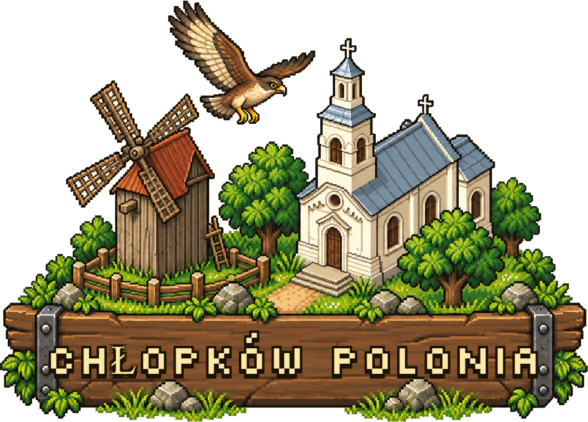
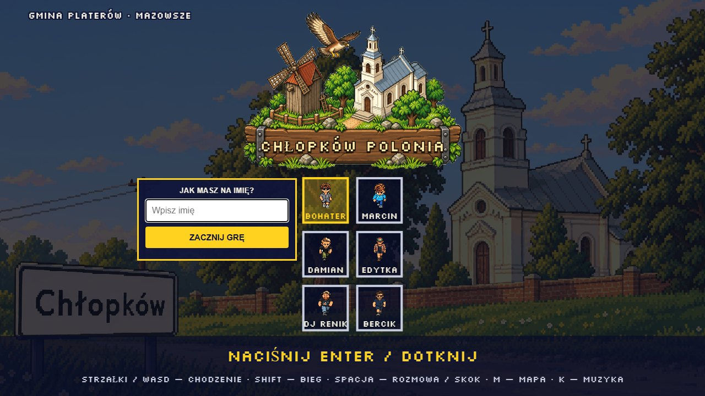
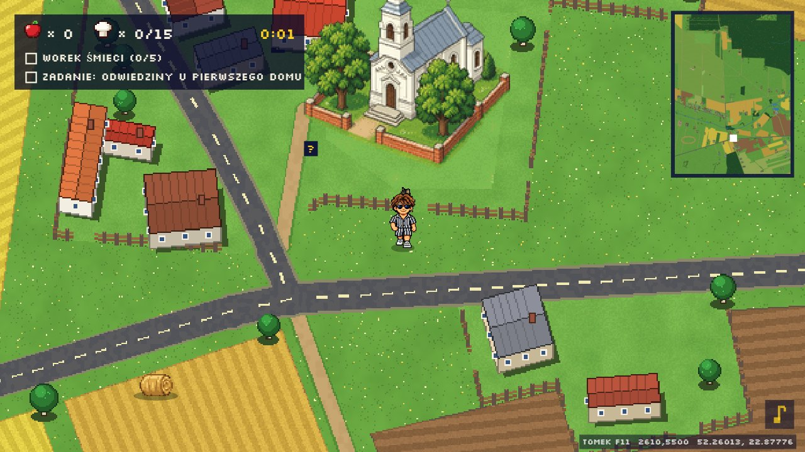
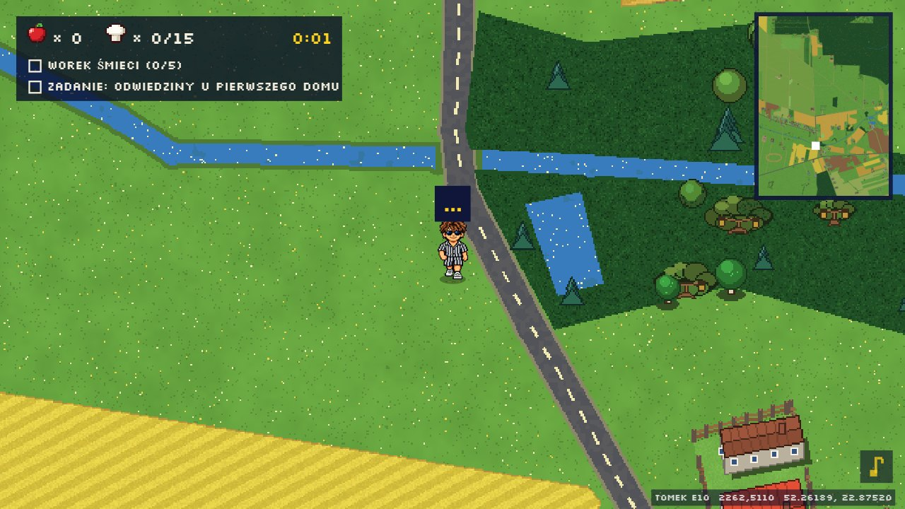
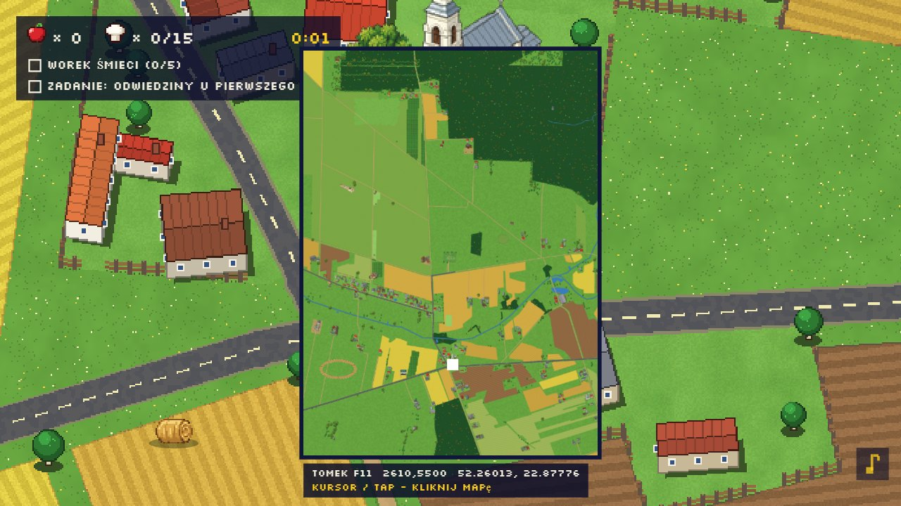

  

  <b>Pikselowa przygoda przez prawdziwą wieś.</b> 
  Gmina Płaterów, Mazowsze · przeglądarka, telefon i komputer · bez instalacji

  <a href="https://itstomekk.github.io/chlopkow-bolonia/"><b>▶ ZAGRAJ TERAZ</b></a>
  &nbsp;·&nbsp;
  <a href="https://itstomekk.github.io/chlopkow-bolonia/brand-guidelines.html">Księga znaku</a>
  &nbsp;·&nbsp;
  <a href="DEVELOPMENT.md">Dla deweloperów</a>

  

## Witaj w Chłopkowie

To krótka, pikselowa przygoda o wsi, którą najlepiej poznaje się noga po nodze: między domami, kościołem, polami i rzeką Melioranką. Mapa opiera się na prawdziwych miejscach, więc kościół, wiatrak „Koźlak", cmentarz, boisko i przydrożne kapliczki stoją tam, gdzie stoją naprawdę.

Wybierz bohatera, wpisz imię i ruszaj. Gra nie wymaga konta ani instalacji.

## Co tu znajdziesz

| | |
|---|---|
| **Wieś do odkrywania** | Domy, pola, las, rzeka i kapliczki. Wypatruj znaków zapytania, bo za każdym kryje się zagadka. |
| **Mieszkańcy** | Babcia Irenka prowadzi kronikę Chłopkowa, dziadek Zdzisiek ma swoje sprawy, a wioska skrywa małą tajemnicę. |
| **Quiz o Chłopkowie** | Sprawdź, ile naprawdę wiesz o okolicy. |
| **Minigry** | Dla tych, którzy wolą bieg, pościg i odrobinę zamieszania. |
| **Wieczór na wsi** | W stodole gra jazz. Warto zajrzeć. |

## Zajrzyj do środka

<table>
  <tr>
    <td width="50%"> <b>Kościół</b>, serce wsi.</td>
    <td width="50%"> <b>Melioranka</b>, rzeka, która kręci się przez okolicę.</td>
  </tr>
  <tr>
    <td colspan="2"> <b>Mapa</b> (klawisz <kbd>M</kbd>). Pokazuje, gdzie jesteś.</td>
  </tr>
</table>

## Sterowanie

| | Komputer | Telefon |
|---|---|---|
| Ruch | strzałki lub `WASD`, albo kliknij cel | przeciągnij palcem |
| Bieg | przytrzymaj `Shift` | wychyl drążek do końca |
| Rozmowa, czytanie | `Spacja`, `E` lub `Enter` obok osoby lub rzeczy | przycisk **A** |
| Skok | `X` lub `J` | przycisk **A** |
| Mapa | `M` | dotknij minimapy |

Pełna lista i szczegóły: [DEVELOPMENT.md](DEVELOPMENT.md).

## Dla deweloperów

Gra to czysty JavaScript na canvasie, bez budowania i bez zależności. Katalog [`docs/`](docs/) jest całą stroną, GitHub Pages serwuje go bez zmian. Uruchomienie lokalne, testy, struktura repozytorium i licencje są w [DEVELOPMENT.md](DEVELOPMENT.md).

Tablica i wordmark powstają ze skryptu `gen/brand/build_brand_assets.py`. Zasady użycia: [księga znaku](https://itstomekk.github.io/chlopkow-bolonia/brand-guidelines.html).

---

CHŁOPKÓW POLONIA · adres repozytorium zachowuje starszą nazwę <code>chlopkow-bolonia</code>, żeby linki i zapisy graczy dalej działały.

