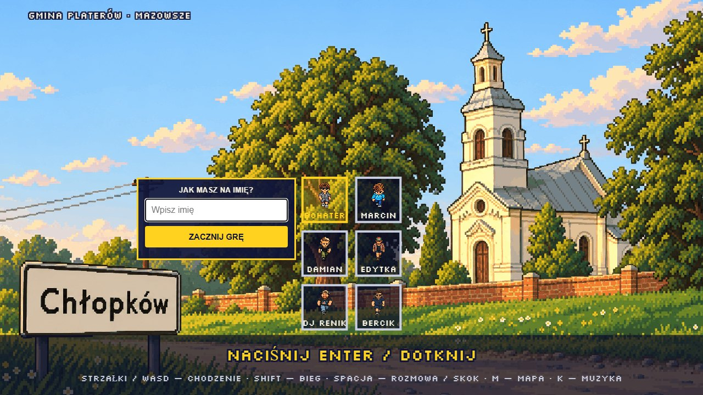

  

  <b>Pikselowa przygoda przez prawdziwą wieś.</b> 
  Gmina Platerów, Mazowsze · przeglądarka, telefon i komputer · bez instalacji

  <a href="https://itstomekk.github.io/chlopkow-bolonia/"><b>▶ ZAGRAJ TERAZ</b></a>
  &nbsp;·&nbsp;
  <a href="#o-chłopkowie">O Chłopkowie</a>
  &nbsp;·&nbsp;
  <a href="https://itstomekk.github.io/chlopkow-bolonia/brand-guidelines.html">Księga znaku</a>
  &nbsp;·&nbsp;
  <a href="DEVELOPMENT.md">Dla deweloperów</a>

  

## Witaj w Chłopkowie

To krótka, pikselowa przygoda o wsi, którą najlepiej poznaje się noga po nodze: między domami, kościołem, polami i rzeką Melioranką. Mapa opiera się na prawdziwych miejscach, więc kościół, wiatrak „Koźlak”, cmentarz, boisko i przydrożne kapliczki stoją tam, gdzie stoją naprawdę.

Wybierz bohatera, wpisz imię i ruszaj. Gra nie wymaga konta ani instalacji.

## Co tu znajdziesz

| | |
|---|---|
| **Wieś do odkrywania** | Domy, pola, las, rzeka i kapliczki. Wypatruj znaków zapytania, bo za każdym kryje się zagadka. |
| **Mieszkańcy** | Babcia Irenka prowadzi kronikę Chłopkowa, dziadek Zdzisiek ma swoje sprawy, a wioska skrywa małą tajemnicę. |
| **Quiz o Chłopkowie** | Sprawdź, ile naprawdę wiesz o okolicy. |
| **Minigry** | Dla tych, którzy wolą bieg, pościg i odrobinę zamieszania. |
| **Wieczór na wsi** | W stodole gra jazz. Warto zajrzeć. |

## Zajrzyj do środka

<table>
  <tr>
    <td width="50%"> <b>Kościół</b>, serce wsi.</td>
    <td width="50%"> <b>Melioranka</b>, rzeka, która kręci się przez okolicę.</td>
  </tr>
  <tr>
    <td colspan="2"> <b>Mapa</b> (klawisz <kbd>M</kbd>). Pokazuje, gdzie jesteś.</td>
  </tr>
</table>

## Sterowanie

| | Komputer | Telefon |
|---|---|---|
| Ruch | strzałki lub `WASD`, albo kliknij cel | przeciągnij palcem |
| Bieg | przytrzymaj `Shift` | wychyl drążek do końca |
| Rozmowa, czytanie | `Spacja`, `E` lub `Enter` obok osoby lub rzeczy | przycisk **A** |
| Skok | `X` lub `J` | przycisk **A** |
| Mapa | `M` | dotknij minimapy |

Pełna lista i szczegóły: [DEVELOPMENT.md](DEVELOPMENT.md).

## O Chłopkowie

Chłopków jest prawdziwą wsią. Leży w powiecie łosickim, w gminie Platerów, w województwie mazowieckim, na pograniczu z Podlasiem, około 12 km na północny wschód od Łosic. Według danych z 2023 roku mieszka tu około 160 osób.

**[📍 Chłopków na Mapach Google](https://www.google.com/maps/search/?api=1&query=52.265278,22.868611)** · [OpenStreetMap](https://www.openstreetmap.org/?mlat=52.265278&mlon=22.868611#map=15/52.265278/22.868611)

### Skąd ta nazwa i ile ma lat

- Wieś zaczęła się w XV wieku jako **Chłopowo**. Około 1450 roku król Kazimierz IV Jagiellończyk nadał ją niejakiemu Mleczce herbu Korczak.
- W latach 1975–1998 Chłopków należał do województwa bialskopodlaskiego. Dziś jest na Mazowszu, ale historycznie i krajobrazowo to południowe Podlasie.
- Wieś jest sołectwem, ma kod pocztowy 08-210.

### Miejsca, które znajdziesz w grze

- **Kościół.** Murowana świątynia z 1890 roku, dawna cerkiew w stylu bizantyjskim. Wcześniejsze drewniane cerkwie stały tu od przełomu XVI i XVII wieku. Pierwsza spłonęła w 1702 roku od uderzenia pioruna, a kolejne budowano w 1704 i 1786 roku. W 1918 roku świątynię przejęli z powrotem katolicy.
- **Cerkwisko i grodzisko.** Obok kościoła zachowały się ślady wczesnośredniowiecznego grodziska, które mieszkańcy zwą „cerkwiskiem”. Dziś to wzniesienie z płaskim szczytem, a na nim stoi plebania z pierwszej połowy XIX wieku.
- **Wiatrak koźlak.** Drewniany wiatrak, przeniesiony do Chłopkowa w 1949 roku ze wsi Szpaki. Mielił do 1972 roku. Wnętrze zachowało się w bardzo dobrym stanie, ale **skrzydeł nie ma**, dlatego w grze wiatrak też stoi bez nich. Według wpisu z 2019 roku właściciele szukają pieniędzy na odbudowę.
- **Okolica.** W pobliżu wsi są sady, lasy i aleja starych lip. Około dwóch kilometrów dalej stoi zespół pałacowy w Hruszniewie.

Znasz Chłopków lepiej niż my i widzisz błąd? Daj znać. Fakty z tej części pochodzą z publicznych źródeł wymienionych poniżej.

### Źródła i linki

- [Wikipedia: Chłopków (województwo mazowieckie)](https://pl.wikipedia.org/wiki/Ch%C5%82opk%C3%B3w_(wojew%C3%B3dztwo_mazowieckie))
- [Wikipedia: Parafia w Chłopkowie](https://pl.wikipedia.org/wiki/Parafia_Narodzenia_Naj%C5%9Bwi%C4%99tszej_Maryi_Panny_w_Ch%C5%82opkowie)
- [Wikipedia: gmina Platerów](https://pl.wikipedia.org/wiki/Plater%C3%B3w_(gmina))
- [Polinów: Chłopków, południowe Podlasie](https://www.polinow.pl/losice_i_okolice-chlopkow) (historia, kościół, grodzisko)
- [Wiatraki w Polsce: Chłopków](http://www.wiatraki.org.pl/admin/html_wiatrak.php?wiatr_id=378) (wiatrak koźlak)
- [Polska Niezwykła: wiatrak koźlak w Chłopkowie](http://polskaniezwykla.pl/web/place/4533,chlopkow-drewniany-wiatrak-kozlak-(xix-xx-w-).html)
- [Urząd Gminy Platerów](https://w.platerow.com.pl/)
- Dane mapy gry: © współtwórcy [OpenStreetMap](https://www.openstreetmap.org/copyright)

## Dla deweloperów

Gra to czysty JavaScript na canvasie, bez budowania i bez zależności. Katalog [`docs/`](docs/) jest całą stroną, GitHub Pages serwuje go bez zmian. Uruchomienie lokalne, testy, struktura repozytorium i licencje są w [DEVELOPMENT.md](DEVELOPMENT.md).

Tablica i wordmark powstają ze skryptu `gen/brand/build_brand_assets.py`. Zasady użycia: [księga znaku](https://itstomekk.github.io/chlopkow-bolonia/brand-guidelines.html).

---

CHŁOPKÓW POLONIA · adres repozytorium zachowuje starszą nazwę <code>chlopkow-bolonia</code>, żeby linki i zapisy graczy dalej działały.

